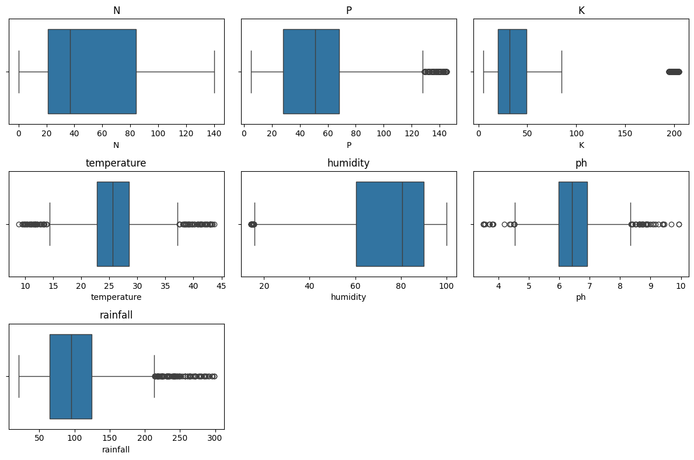
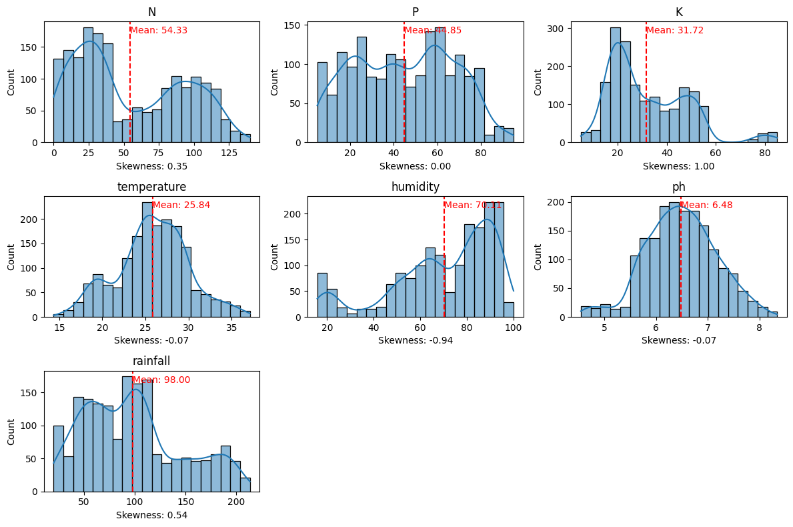
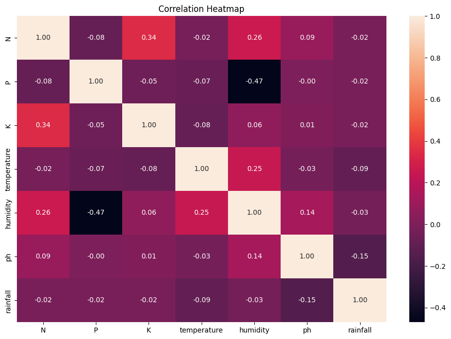
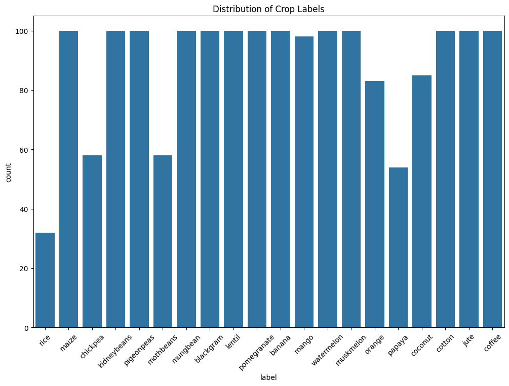
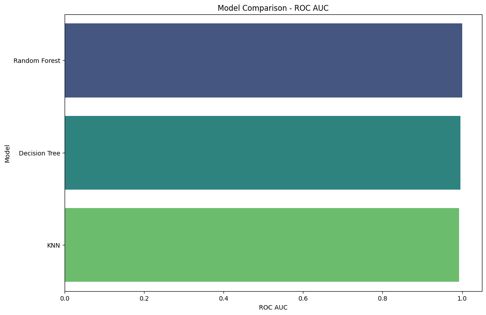

# Laporan Proyek Machine Learning - Muhammad Husni Zahran Nugrahanto

## Domain Proyek
Proyek ini memiliki domain di bidang pertanian yang berfokus kepada prediksi kecocokan tanaman terhadap kondisi lahan dan lingkungan tertentu.


### Latar Belakang
Indonesian merupakan negara agraris yang memiliki ketergantungan tinggi pada sektor pertanian sebagai penopang ekonomi dan ketahanan pangan. Namun, produktivitas dari sektor ini seringkali terhambat karena ketidaksesuaian antara jenis tanaman pertanian yang ditanam dengan kondisi lingkungan setempat, seperti kandungan unsur hara dalam tanah, suhu, pH tanah, dan curah hujan. ketidak sesuaian ini dapat menyebabkan hasil panen yang rendah dan kerugian bagi petani.

Sebagai contoh, studi kasus pada tanaman jagung di Kabupaten Malang menunjukkan bahwa produktivitas jagung dipengaruhi secara signifikan oleh faktor suhu dan intensitas curah hujan [[1](https://journal.ipb.ac.id/index.php/JIPI/article/view/51574/30158)]. Selain itu, penelitian lain mengenai pertumbuhan tanaman secara umum juga menemukan bahwa kondisi lingkungan seperti suhu, kelembapan udara, intensitas cahaya, dan curah hujan turut menentukan baik atau buruknya perkembangan tanaman [[2](https://journal.uii.ac.id/Snati/article/view/3126/2859)]. Oleh karena itu, pemilihan jenis tanaman yang sesuai dengan karakteristik lingkungan setempat menjadi krusial untuk meningkatkan produktivitas pertanian dan mengurangi risiko kerugian bagi petani.

### Permasalahan dan Solusi yang Ditawarkan
Permasalahan utama yang dihadapi adalah kurangnya sistem yang dapat memberikan rekomendasi tanaman secara akurat berdasarkan variabel lingkungan seperti kandungan nitrogen (N), fosfor (P), kalium (K), suhu, kelembaban, pH tanah, dan curah hujan. Selain itu, Kebanyakan petani masih mengandalkan pengetahuan tradisional atau pengalaman pribadi, yang mungkin tidak selalu sesuai dengan kondisi aktual lahan mereka. Oleh karena itu, diperlukan solusi berbasis data yang mampu untuk mengintegrasikan variabel-variabel lingkungan  dengan metode analitik guna menghasilkan rekomendasi tanaman yang lebih akurat. 

Masalah ini penting untuk diselesaikan karena:
- **Meningkatkan Produktivitas:** \
Dengan memilih tanaman yang sesuai, hasil panen dapat meningkat secara signifikan.
- **Efisiensi Sumber Daya:** \
Penggunaan pupuk dan air dapat dioptimalkan sesuai kebutuhan tanaman yang direkomendasikan.
- **Katahanan Pangan:** \
Dengan hasil panen yang lebih baik, ketahanan pangan nasional dapat terjaga.
- **Pengurangan Risiko Kerugian:** \
Petani dapat mengurangi risiko kerugian akibat gagal panen karena ketidaksesuaian tanaman dengan kondisi lingkungan.

Dengan demikian, dilakukan pengembangan model *machine learning* (ML) yang dapat mempelajari pola dari data historis sehingga dapat memberikan rekomendasi yang lebih akurat dan adaptif  terhadap perubahan kondisi lingkungan.

## Business Understanding
Pengembangan model prediksi dalam memilih tanaman yang tepat dengan kondisi lingkungan setempat dapat memberikan manfaat bagi berbagi pihak yang salah satunya adalah petani. Dengan solusi berbasis data ini, diharapkan dapat memberikan rekomendasi tanaman yang optimal terhadap kondisi lingkungan setempat. Dengan demikian, petani dapat menurunkan risiko kerugian serta meningkatkan efisiensi sumber daya yang dibutuhkan.

### Problem Statements
Berdasarkan latar belakang, berikut adalah rincian masalah yang dapat dirumuskan dalam proyek ini:
- Bagaimana cara memilih tanaman yang cocok berdasarkan variabilitas kondisi lahan (N, P, K, pH) dan iklim (suhu, kelembapan, dan urah hujan)?
- Bagaimana cara menurunkan risiko gagal panen dampak dari kesalahan dalam memilih tanaman?

### Goals
Tujuan dari proyek ini adalah:
- Mengembangkan serta melatih model ML untuk merekomendasikan tanaman sesuai dengan kondisi lingkungan setempat.
- Menargetkan nilai matrik evaluasi model ROC-AUC minimal 0.80 pada data uji.

### Solution statements
Untuk mencapai tujuan proyek ini, akan dilakukan pengembangan model ML dengan tiga pendekatan solusi yang dievaluasi dengan metrik ROC-AUC serta akurasi dari data pelatihan (train) dan pengujian (test) untuk mendeteksi potensi *overfitting* pada model:
- Model yang digunakan:
    - *Decision Tree Classifier* adalah model yang mirip dengan bagan alur dengan serangakian pertanyaan "ya/tidak" untuk membagi data menjadi beberapa kelompok hingga mencapai hasil keputusan di ujung setiap cabang[[3](https://medium.com/@MrBam44/decision-trees-91f61a42c724)].
    - *Random Forest Classifier* adalah pengembangan dari algoritma decision tree, model ini membangun banyak decision tree  secara acak (dengan subset data dan fitur yang berbeda) kemudian mengabungkan hasil prediksi sebagai "suara mayoritas" sebagai hasil akhirnya[[4](https://ishanjainoffical.medium.com/understanding-random-forest-algorithm-with-python-code-ae6fb0e34938)].
    - *K-Nearest Neighbors* (KNN) adalah metode yang mengklasifikasi data baru dengan melihat $k$ tetangga terdekat pada ruang fitur dan menetapkan kelas berdasarkan kelas yang paling banyak muncul diantara tetangga tersebut[[5](https://medium.com/swlh/k-nearest-neighbor-ca2593d7a3c4)]. 
- Prosedur evaluasi:
    - Membagi dataset menjadi set pelatihan dan pengujian dengan proporsi 80% data pelatihan dan 20% data pengujian.
    - Melatih model ML dengan data pelatihan.
    - Pengukuran kinerja dengan menghitung akurasi pada data pelatihan dan pengujian dan menghitung ROC-AUC pada data pelatihan.
    - Membandingkan selisih nilai akurasi antara data pelatihan dengan data pengujian jika selisih akurasi $>0,05$ model dianggap memiliki potensi *overfitting*.
    - Memilih model  dengan keseimbangan optimal (ROC-AUC tinggi) dan tidak memiliki potensi *overfitting*.

## Data Understanding
Dataset yang digunakan berasal dari [Kaggle](https://www.kaggle.com) yang berisi informasi mengenai jenis tanaman yang cocok untuk dibudidayakan sesuai dengan kondisi lingkungan setempat. Dataset terdiri dari 2200 observasi tanpa nilai yang hilang dan data duplikat dengan 8 fitur yang mencakup 7 fitur input numerik dan 1 fitur target output berupa jenis tanaman yang sesuai. berikut adalah ringkasan informasi dari dataset:
| Jenis        | Keterangan                                                                                           |
|--------------|------------------------------------------------------------------------------------------------------|
| Title        | Crop Recommendation Dataset                                                                          |
| Source       | [Kaggle](https://www.kaggle.com/datasets/madhuraatmarambhagat/crop-recommendation-dataset/data)                  |
| Maintainer   | [Atharva Ingle](https://www.kaggle.com/madhuraatmarambhagat)                                                 |
| License      | [Apache 2.0](https://www.apache.org/licenses/LICENSE-2.0)                                                                                |
| Visibility   | Publik                                                                                               |
| Tags         | Business, Beginner, Classification, Intermediate, Advanced, Agriculture                     |
| Usability    | 10.00                                                                                                |

Berikut adalah cuplikan dari datset:
| N  | P  | K  | Temperature | Humidity | pH  | Rainfall | Label |
|----|----|----|-------------|----------|-----|-----------|--------|
| 90 | 42 | 43 | 20.87       | 82.0     | 6.50 | 202.9     | rice   |
| 85 | 58 | 41 | 21.77       | 80.3     | 7.00 | 226.4     | rice   |
| 60 | 55 | 44 | 23.00       | 82.0     | 7.20 | 263.9     | rice   |
| 74 | 35 | 40 | 26.65       | 80.0     | 6.90 | 242.7     | rice   |
| 78 | 42 | 42 | 20.87       | 82.0     | 6.50 | 202.9     | rice   |

### Fitur pada Corp Recommendation dataset
| Nama Fitur     | Deskripsi                                    | Satuan  |
|----------------|----------------------------------------------|---------|
| `N`            | Kandungan Nitrogen dalam tanah               | mg/kg   |
| `P`            | Kandungan Fosfor dalam tanah                 | mg/kg   |
| `K`            | Kandungan Kalium dalam tanah                 | mg/kg   |
| `temperature`  | Suhu rata-rata lingkungan                    | °C      |
| `humidity`     | Kelembaban relatif rata-rata                 | %       |
| `ph`           | Derajat keasaman tanah (pH)                  | -       |
| `rainfall`     | Curah hujan rata-rata tahunan                | mm      |
| `label`        | Jenis tanaman yang paling cocok ditanam berdasarkan kondisi tersebut | Kategori |

### *Exploratory Data Analysis* (EDA)
#### Deteksi Nilai yang Hilang (*Missing Value*)
Nilai yang hilang (*Missing Value*) pada data perlu dideteksi karena dapat menimbulakan masalah serius pada saat pemodelan. Pertama, banyak algoritma hanya bisa memproses baris data yang lengkap, sehingga baris dengan missing values akan dibuang, yang menyebabkan ukuran sampel berkurang. Kedua, jika pola missing tidak acak (misalnya, hanya responden sakit yang tidak menjawab pertanyaan kesehatan), maka model yang dibangun bisa bias karena data tidak lagi merepresentasikan populasi sebenarnya. Ketiga, adanya nilai kosong dapat membuat perhitungan matematis pada algoritma gagal atau tidak konvergen. Deteksi *missing value* dapat dilakukan dengan kode sebagai berikut:
```Python
df.isnull().sum()
```
Dari deteksi yang dilakukan diperoleh:
```Python
Jumlah nilai yang hilang: 0
```
Diperoleh bahwa data yang digunakan dalam proyek tidak memiliki *missing value*. Dengan demikian, proses pemodelan dapat dilakukan tanapa perlu melakukan imputasi atau menghapus data.

#### Deteksi Nilai Duplikat
Nilai duplikat adalah baris data yang muncul lebih dari satu kali dengan nilai yangf sama dengan baris data yang lainnya. Nilai ini perlu dideteksi karena dapat mengakibatkan dapat menurunkan pada performa model. Pertama, mengakibatkan *overfitting* karena model akan terlalu menyesuaikan diri pada pelatihan dan kurang mampu menangkap pola yang baru didata yang sebenarnya. Kedua, mengganggu keseimbangan distribusi dan proporsi dari masing-masing kelas sehingga prediksi menjadi bias pada salah satu kelas. Ketiga, pemborosan pada sumber daya komputasi (waktu pelatihan dan memori) karena model harus memproses lebih banyak data yang kurang informatif. Deteksi nilai duplikat dapat dilakukan dengan kode sebagai berikut:
```Python
df.duplicated()
```
Dari deteksi yang dilakukan diperoleh:
```Python
Jumlah nilai duplikat: 0
```
Diperoleh bahwa data yang digunakan dalam proyek tidak memiliki nilai duplikat. Dengan demikian, proses pemodelan dapat dilakukan tanapa perlu menghapus data.

#### Deteksi Nilai Ekstream (*Outlier*) dengan Visualisasi Boxplot

Visulisasi *boxplot* adalah salah satu metode analisis univariat yang digunakan untuk melihat sebaran data numerik. Dari visualisasi *boxplot* diperoleh bahwa fitur `p`, `K`, `Temperature`, `humidity`, `pH`, dan `rainfall` memiliki  (*outlier*). Oleh karena itu, dilakukan penanganan *outlier* dengan metode *interquartile range* (IQR).

#### Penanganan Nilai Ekstream (*Outlier*) dengan metode 
Penanganan *outlier* diperlukan karena *outlier* dapat menyebabkan bias pada batas-batas klasifikasi terutama pada algoritma berbasis jarak. Selain itu, dengan mengapus *outlier* dapat mengurangi *noise* dan meningkatkan performa dari model klassifikasi. 

Setelah dilakukan penanganan pada *outlier* data jumlah observasi data berkurang menjadi 1768 observasi dan diperoleh sebaran data dengan visualisasi histogram sebagai berikut:
 
 Interpretasi:
 
| Nama Fitur    | Mean  | Skewness | Keterangan                                                        |
|---------------|-------|----------|------------------------------------------------------------------|
| `N`           | 54.33 | 0.35     | Distribusi sedikit miring ke kanan, relatif mendekati simetris.  |
| `P`           | 44.85 | 0.00     | Distribusi sangat simetris dengan data tersebar cukup merata.    |
| `K`           | 31.72 | 1.00     | Distribusi miring ke kanan dengan ekor data lebih panjang.       |
| `temperature` | 25.84 | -0.07    | Distribusi cukup normal dengan sedikit kemiringan ke kiri.       |
| `humidity`    | 70.11 | -0.94    | Distribusi miring ke kiri dengan ekor data lebih panjang.        |
| `ph`          | 6.48  | -0.07    | Distribusi mendekati normal dan hampir simetris.                 |
| `rainfall`    | 98.00 | 0.54     | Distribusi sedikit miring ke kanan.                              |
| `label encoded`| 9.18 | 0.08     | Data numerik hasil encoding dengan distribusi cukup simetris.    |

#### Multivariate Analysis

Visualisasi Heatmap digunakan untuk mengambarkan korelasi antara pasangan fitur numerik. Dari visualisasi diperoleh bahwa tidak ada fitur yang memiliki korelasi yang kuat (mendekati 1 atau -1). Fitur `humidity` memiliki hubungan negatif yang cukup kuat dengan `P` dan hubungan positif dengan `N` dan `temperature`. Fitur `N` dan `K` juga memiliki hubungan positif yang sedang. Sedangkan variabel yang lainnya secara umum memiliki korelasi hubungan yang rendah antara satu sama lain.

### Fitur Target

Visualisasi *coutplot* menampilkan distribusi dari fitur kategorik target. Dari visualisasi *coutplot*, diperoleh bahwa fitur target memiliki 20 kelas dengan jumlah observasi yang bervariasi. Sebagian besar kelas memilki 100 observasi, tapi beberapa kelas seperti rice (32), papaya (54), dan chickpea (58) jauh lebih sedikit jika dibandingkan dengan kelas yang lain. Hal ini dapat diartikan bahwa jumlah observasi pada setiap kelasnya tidak seimbang sehingga dapat mempengaruhi performa model.

## Data Preparation
Berikut adalah tahapan dalam menyiapkan data secara berurutan:
- **Penanganan *outlier*** \
metode IQR adalah metode yang digunakan untuk mengatasi *outlier* dengan mebuang/menghapus nilai yang berada diluar batas atas dan batas bawah. Cara mengidetifikasi *outlier* adalah dengan mengurutkan nilai numerik dan membaginya menjadi empat bagian sama rata. Titik di akhir bagian pertama disebut $Q1$ (kuartil pertama), dan titik di akhir bagian ketiga disebut $Q3$ (kuartil ketiga). Jarak antara $Q1$ dan $Q3$ disebut IQR. secara matematis dapat dituliskan sebagai berikut: 

$$IQR=Q3−Q1$$ 

$$Batas Bawah=Q1−1,5×IQR$$

$$Batas Atas=Q3+1,5×IQR$$

Semua data yang nilainya kurang dari Batas Bawah atau lebih dari Batas Atas dianggap outlier dan dihapus[[6](https://medium.com/@pp1222001/outlier-detection-and-removal-using-the-iqr-method-6fab2954315d)].

Metode ini dipilih karena bersifat robust, sederhana, dan tidak memerlukan asumsi distribusi. Dengan menggunakan IQR, kita dapat secara objektif menentukan nilai-nilai yang sangat menyimpang dari pola umum data tanpa terpengaruh oleh outlier itu sendiri. Dengan demikian, model dapat lebih akurat dan stabil karena data menjadi lebih bersih tanpa penyimpangan yang tidak wajar.
- **Mengubah label target ke bentuk numerik** \
Karena variabel target berupa kolom dengan tipe data `object`, dilakukan konversi nilai menjadi bentuk numerik denga mengggunakan kode sebagai berikut:
    ```Python
    df['label_encoded'] = df['label'].astype('category').cat.codes
    ```
    Proses ini harus dilakukan karena hampir semua algoritma *machine learning* hanya menerima input numerik.Selain itu, encoding yang tepat menjaga konsistensi *preprocessing* pada data dan mencegah model salah menafsirkan jarak atau urutan antar kategori, sehingga prediksi menjadi lebih akurat dan stabil.
- **Spliting data** \
Membagi dataset menjadi dua bagian sebagai data latih (*train*) dan data uji (*test*). Pembagian dataset bertujuan untuk melatih dan mengevaluasi kinerja dari model. Pada proyek ini, digunakan proporsi *train* sebesar $80%$ untuk melatih model dan *test* sebesar *20%* untuk mengevaluasi kinerja dari model.
- **Standarisasi data** \
mengubah skals nilai fitur numerik dengan tujuan supaya fitur numerik memiliki $\text{rata-rata}(\mu)=0$ dan $\text{simpangan baku}(\sigma)=1$ [[7](https://medium.com/@onersarpnalcin/standardscaler-vs-minmaxscaler-vs-robustscaler-which-one-to-use-for-your-next-ml-project-ae5b44f571b9)]. Secara matematis dapat dituliskan, sebagai berikut: 

$$Z=\frac{X-\mu}{\sigma}$$

Keterangan: \
$Z$ : Nilai hasil standarisasi \
$X$ : Nilai asli \
$\mu$ : rata-rata dari seluruh nilai pada fitur tersebut \
$\sigma$ : simpangan baku dari fitur tersebut 

Tujuan dari tahapan ini adalah supaya setiap fitur memiliki kontribusi yang setara saat melatih model sehingga dapat meningkatkan performa dari model.

## Modeling
Untuk menyelesaikan permasalahan dikembangkan model klasifikasi tanaman yang cocok ditanam berdasarkan kondisi longkungan (N, P, K, suhu, kelembaban, pH tanah, dan curah hujan), digunakan pendekatan tiga algoritma machine learning:
- *Nearest Neighbors* (KNN) \
KNN adalah metode berbabsis jarak yang mencari $k$ titik data terdekat (*neighbors*) berdasarkan jarak terdekat. Kemudian, klasifikasi ditentukan dengan "suara mayoritas" dari $k$ tetangga tersebut. Algoritma KNN dapat dilaukan dengan kode sebagai berikut:

    ```python
    from sklearn.neighbors import KNeighborsClassifier
    knn = KNeighborsClassifier()
    ``` 
    pada proses ini, model menggunakan parameter bnawaan (jumlah tetangga $(k) = 5$). Kelebihan algoritma ini adalah sederhana dan mudah diimprlementasikan. namun algoritma ini sensitif terhadap skala fitur karena berbasis jarak dan lambat saat digunakan pada data besar.
- *Decision Tree* \
*Decision Tree* adalah metode yang memecah ruang fitur secara herarkis dengan tujuan untuk mengelompokkan sampel ke dalam beberapa kelas. Setiap simpul memiliki satu fitur dan satu nilai amabang batas untuk membagi data menjadi dua bagian atau lebih cabang. Proses ini berlanjut sampai data dapat dikelompokkan sesuai dengan taget kelas tertentu. Algoritma *Decision Tree* dapat dilakukan dengan kode sebagai berikut:

    ```python
    from sklearn.tree import DecisionTreeClassifier
    dt = DecisionTreeClassifier(random_state=42)
    ```
    pada proses ini, model menggunakan parameter `random_satate=42` untuk menjaga keluaran model agar tetap identik setiap dijalankan. Kelebihan dari algoritma ini adalah interpretatif, mudah divisualisasikan, dan dapat menangani fitur numerik dan kategorik. Namun, cenderung mudah *overfitting* dan tidak stabil pada perubahan data.
- *Random Forest* \
*Random Forest* adalah metode yang dikembangkan dari *decision tree* dengan membangun banyak *decision tree* secara paralel pada sampel data dengan pengembalian dari data asli. Pada setiap simpul hanya sekelompok kecil dari sampel fitur yang dipertimbangkan untuk dipisah. Dengan demikian, setiap pohon menjadi spesialis pada subset data dan fitur yang berbeda. Proses klasifikasi dilakukan dengan "suara mayoritas" dari setiap pohon. Pendekatan ini mengurangi *overfitting* yang sering timbul di pohon tunggal sehingga menghasilkan model yang lebih stabil dan akurat terutama saat jumlah fitur besar. Algoritma *Random Forest* dapat dilakukan dengan kode sebagai berikut:

    ```python
    from sklearn.ensemble import RandomForestClassifier
    rf = RandomForestClassifier(random_state=42)
    ```
    pada proses ini, model menggunakan parameter `random_satate=42` untuk menjaga keluaran model agar tetap identik setiap dijalankan. Kelebihan dari algoritma ini adalah memiliki akurasi tinggi, dapat mengurangi *overfitting* dari algoritma *Decision Tree* tunggal dan lebih robust terhadap noise. Namun, membutuhkan waktu latih yang lebih lama dan kurang dapat diinterpretasikan.

## Evaluation
Untuk mengevaluasi performa dari model ML dalam melakukan prediksi jenis tanaman yang cocok ditanam berdasarkan kondisi lingkungan setempat digunakan metrik, sebagai berikut:
- Akurasi (*accuracy*) \
Akurasi adalah rasio jumlah prediksi yang benar terhadap seluruh jumlah data atau secara matematis[[8](https://medium.com/@prateekgaurav/mastering-classification-metrics-a-beginners-guide-part-1-accuracy-precision-and-recall-fbadc90654ab)]:

$$Akurasi = \frac{TP + TN}{TP + TN + FP + FN}$$

keterangan: \
$TP (\text{True Positive}):$ Prediksi benar untuk kelas positif. \
$TN (\text{True Negative}):$ Prediksi benar untuk kelas negatif. \
$FP (\text{False Positive}):$ Prediksi salah, positif padahal sebenarnya negatif. \
$FN (\text{False Negative}):$ Prediksi salah, negatif padahal sebenarnya positif. 

- ROC-AUC (*Receiver Operating Characteristic – Area Under Curve*) \
ROC-AUC mengukur kemampuan model dalam membedakan antara kelas positif dan negatif[[9](https://towardsdatascience.com/understanding-the-roc-curve-and-auc-dd4f9a192ecb/)]. ROC adalah kurva yang menggambarkan hubungan antara:

$$True Positive Rate (TPR) = Sensitivitas = TP / (TP + FN)$$

$$False Positive Rate (FPR) = FP / (FP + TN)$$

AUC (*Area Under Curve*) menunjukkan seberapa baik model membedakan kelas. Nilai AUC:
- 0.5 → model tidak lebih baik dari tebakan acak
- 1.0 → model sempurna
Semakin tinggi nilai AUC, semakin baik performa model dalam mengklasifikasi dengan *threshold* yang bervariasi.

Berikut adalah hasil evaluasi dari masing-masing model:
| Model          | Train Accuracy | Test Accuracy | ROC AUC | Overfitting |
|----------------|----------------|---------------|---------|-------------|
| Random Forest  | 1.000          | 0.994         | 1.000   | No          |
| Decision Tree           | 1.000          | 0.997         | 0.996   | No          |
| KNN  | 0.981          | 0.966         | 0.992   | No |

Interpretasi:
- Akurasi train dan test berada di atas 96% 
- ROC-AUC di atas 0.99 menunjukkan kemampuan klasifikasi yang sangat baik secara probabilistik.
- Selisih antara akurasi train dan test pada semua model $< 0.05$ → model mampu menggeneralisasi dengan baik pada data uji.
- *Random Forest* dan *Decision Tree* sama-sama mencapai akurasi train 1.000, namun *Random Forest* sedikit lebih baik dalam AUC (1.000 vs. 0.996).
- KNN memiliki performa sedikit di bawah dua model lainnya, tetapi tetap sangat baik, dengan ROC AUC 0.992. 


**Kesimpulan:** \
*Random Forest* menjadi model terbaik secara keseluruhan, karena mampu mencapai akurasi dan ROC-AUC sempurna di data train dan test. meskipun *Decision Tree* sangat mendekati, *Random Forest* biasanya lebih stabil dan tahan terhadap noise berkat algoritma ensemble-nya.


## Refrerensi
[[1](https://journal.ipb.ac.id/index.php/JIPI/article/view/51574/30158)] N. Herlina dan A. Prasetyorini, "Pengaruh Perubahan Iklim pada Musim Tanam dan Produktivitas Jagung (Zea mays L.) di Kabupaten Malang," *Jurnal Ilmu Pertanian Indonesia (JIPI)*, vol. 25, no. 1, pp. 118–128, Jan. 2020, doi: [10.18343/jipi.25.1.118.](10.18343/jipi.25.1.118.) \
[[2](https://journal.uii.ac.id/Snati/article/view/3126/2859)] D. Heksaputra, Y. Azani, Z. Naimah, dan L. Iswari, "Penentuan Pengaruh Iklim Terhadap Pertumbuhan Tanaman dengan Naïve Bayes," *Seminar Nasional Aplikasi Teknologi Informasi (SNATI)*, Yogyakarta, vol. N-34, pp. N-34–N-39, Jun. 2013, ISSN: 1907-5022. \
[[3](https://medium.com/@MrBam44/decision-trees-91f61a42c724)] S. Koli, “Decision Trees: A Complete Introduction With Examples,” Medium, Feb. 27, 2023. [Online]. https://medium.com/@MrBam44/decision-trees-91f61a42c724. \
[[4](https://ishanjainoffical.medium.com/understanding-random-forest-algorithm-with-python-code-ae6fb0e34938)] Data Science & Beyond, “Understanding Random Forest Algorithm with Python Code,” Medium, Oct. 2, 2023. [Online]. https://ishanjainoffical.medium.com/understanding-random-forest-algorithm-with-python-code-ae6fb0e34938. \
[[5](https://medium.com/swlh/k-nearest-neighbor-ca2593d7a3c4)] A. Christopher, “K-Nearest Neighbor,” The Startup, Medium, Feb. 2, 2021. [Online]. https://medium.com/swlh/k-nearest-neighbor-ca2593d7a3c4. \
[[6](https://medium.com/@pp1222001/outlier-detection-and-removal-using-the-iqr-method-6fab2954315d)] P. Patel, “Outlier Detection and Removal using the IQR Method,” Medium, Dec. 14, 2021. [Online]. Available: https://medium.com/@pp1222001/outlier-detection-and-removal-using-the-iqr-method-6fab2954315d. \
[[7](https://medium.com/@onersarpnalcin/standardscaler-vs-minmaxscaler-vs-robustscaler-which-one-to-use-for-your-next-ml-project-ae5b44f571b9)] O. S. Nalçin, "StandardScaler vs MinMaxScaler vs RobustScaler — Which one to use for your next ML project?," Medium, May 4, 2023. [Online]. https://medium.com/@onersarpnalcin/standardscaler-vs-minmaxscaler-vs-robustscaler-which-one-to-use-for-your-next-ml-project-ae5b44f571b9. \
[[8](https://medium.com/@prateekgaurav/mastering-classification-metrics-a-beginners-guide-part-1-accuracy-precision-and-recall-fbadc90654ab)] P. Gaurav, “Mastering Classification Metrics: A Beginner’s Guide (Part 1) – Accuracy, Precision, and Recall,” Medium, Sep. 28, 2023. [Online]. https://medium.com/@prateekgaurav/mastering-classification-metrics-a-beginners-guide-part-1-accuracy-precision-and-recall-fbadc90654ab. \
[[9](https://towardsdatascience.com/understanding-the-roc-curve-and-auc-dd4f9a192ecb/)] S. Sharma, “Understanding the ROC Curve and AUC,” Towards Data Science, Sep. 28, 2023. [Online]. https://towardsdatascience.com/understanding-the-roc-curve-and-auc-dd4f9a192ecb/.
