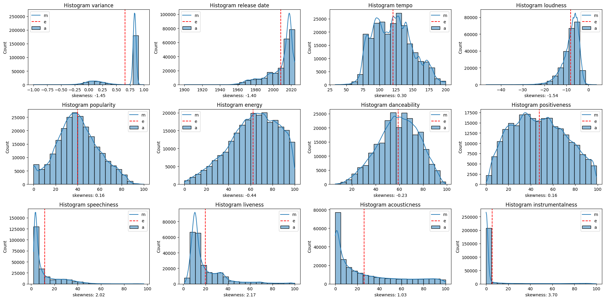
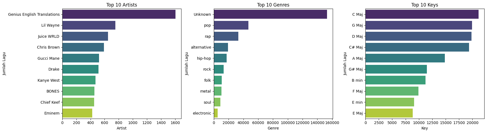
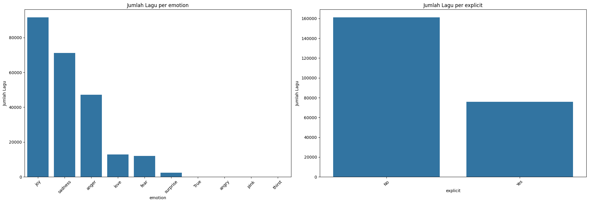

# Laporan Proyek Machine Learning - Muhammad Husni Zahran Nugrahanto

## Project Overview
Pada era *streaming* musik, *platform* seperti Spotify mengalami pertumbuhan pesat dengan ratusan juta pengguna aktif disetiap bulannya. Namun, dengan katalog lebih dari ratusan juta lagu, pengguna sering mengalami kesulitan dalam menemukan trek baru yang sesuai dengan selera mereka. Dengan demikian, proyek ini memanfaatkan dataset *"200k Spotify Songs Light Dataset dari Kaggle" yang memuat metadata (artist, song, Genre, Release Date, Key, Explicit) serta 18 fitur audio dan konten—meliputi tempo, loudness, energy, danceability, positiveness (valence), speechiness, acousticness, instrumentalness, liveness, popularity, emotion (ekstraksi dari lirik), dan variance antar fitur—untuk lagu-lagu terbitan 1921–2020*[[1](https://www.kaggle.com/datasets/devdope/200k-spotify-songs-light-dataset)].


Proyek ini penting karena alasan berikut:
1. Rekomendasi yang lebih akurat mampu meningkatkan waktu dan kepuasan poengguna dalam menggunakan platform *streaming*.
2. Personalisasi *playlist* otomatis dapat mendorong pertumbuhan retensi dari pengguna dan konversi pengguna dari gratis ke berbayar.
3. proyek ini memberikan kontribusi praktis dan ilmiah dengan menguji efektivitas metode *nearest neighbors* (yang bersifat explainable) pada skala dataset menengah besar di domain musik.

Pendekatan *content-based filtering* menggunakan algoritma *nearest neighbors* memodelkan setiap lagi sebagai kombinasi antara fitur konten dan audio. Metode ini menghasilkan rekomendasi dengan menghitung jarak (pada proyek ini digunakan *cosine similarity*) antar vektor lagu yang sedang didengar pengguna dengan vektor lagu lain, kemudian dipilih $k$ lagu terdekat sebagai rekomendasi[[2](https://www.geeksforgeeks.org/recommender-systems-using-knn/)]. Metode ini dipilih karena mudah untuk diimplementasikan dan dapat dengan efektif menangani *cold-star* pada lagu yang belum memiliki riwayat interaksi pengguna selama metadata dan fitur audio tersedia[[3](https://en.wikipedia.org/wiki/Cold_start_(recommender_systems))].

## Business Understanding
Pada era digital saat ini, layanan streaming musik seperti Spotify menghadapi tantangan besar dalam memberikan pengalaman mendengarkan yang personal dan memuaskan bagi setiap penggunanya. Dengan jutaan lagu yang tersedia, pengguna sering kali kesulitan menemukan lagu baru yang sesuai dengan preferensi mereka. Sistem rekomendasi menjadi komponen krusial dalam meningkatkan keterlibatan pengguna dan mendorong eksplorasi musik baru. Dalam proyek ini, dikembangkan sistem rekomendasi lagu berbasis *content-based filtering* menggunakan algoritma *K-Nearest Neighbors* (KNN), dengan memanfaatkan 18 fitur konten dan audio dari dataset Spotify.

### Problem Statements
Berdasarkan latar belakang, berikut adalah rincian masalah yang dapat dirumuskan dalam proyek ini:
- Bagaimana sistem rekomendasi dapat mensolusikan masalah *cold-start* pada lagu-lagu baru yang belum memiliki data rating atau interaksi??
- Bagaimana memanfaatkan 18 fitur konten dan audio untuk menilai kemiripan antar lagu secara akurat?

### Goals
Tujuan dari proyek ini adalah:
- Mengembangkan sistem rekomendasi dengan pendekatan *content-based filtering* yang dapat merekoemndasikan lagu berdasarkan kemiripan fitur konten dan audion tanpa tergantung pada riwayat interaksi antar pengguna sehingga lagu baru tetap dapat direkomendasikan. 
- Sistem rekomendasi memanfaatkan fitur konten dan audio untuk menghitung kemiripan antar musik sehingga hasilnya bersifat objektif sesuai dengan karakteristik musik.

### Solution Approach
Untuk mencapai tujuan proyek, dilakukan pengembangan sistem rekomenndasi dengan pendekatan *content-based filtering* dan algoritma yang digunakan adalah sebagai berikut:
- Membuat matriks TF-IDF untuk kombinasi fitur kategorik.
- Mengubah skala fitur numerik dengan `MinMaxScaler`
- Membuat sistem rekomendasi dengan `NearestNeighbors`
- Mengevaluasi sistem rekomendasi dengan menggunakan metrik *Normalized Discounted Cumulative Gain* (NDCG)

## Data Understanding
Dataset yang digunakan berasal dari [Kaggle](https://www.kaggle.com) yang berisi kumpulan lagu Spotify yang terdiri dari 200.000 lagu dengan 236.988 observasi. Data ini memiliki 18 fitur utama yang mencakup informasi artis, lagu, emosi, serta karakteristik akustik seperti tempo, energi, dan danceability. Berikut adalah ringkasan informasi dari dataset:
| Jenis        | Keterangan                                                                                           |
|--------------|------------------------------------------------------------------------------------------------------|
| Title        | 🎧 200K+ Spotify Songs Light Dataset                                                                          |
| Source       | [Kaggle](https://www.kaggle.com/datasets/devdope/200k-spotify-songs-light-dataset)                  |
| Maintainer   | [DevDope](https://www.kaggle.com/devdope)                                                 |
| License      | [Attribution-NonCommercial 4.0](https://creativecommons.org/licenses/by-nc/4.0/)                                                                                |
| Visibility   | Publik                                                                                               |
| Tags         | Arts and Entertainment, Education, Music, Text Generation                     |
| Usability    | 9.41                                                                                                |

Berikut adalah cuplikan dari datset:
| artist | song                  | emotion | variance  | Genre | Release Date | Key    | Tempo | Loudness | Explicit | Popularity | Energy | Danceability | Positiveness | Speechiness | Liveness | Acousticness | Instrumentalness |
|--------|-----------------------|---------|-----------|-------|---------------|--------|--------|-----------|----------|-------------|--------|---------------|---------------|--------------|----------|---------------|-------------------|
| ABBA   | She's My Kind Of Girl| joy     | 0.447619  | pop   | 2014          | F Maj  | 128    | -6.00     | No       | 31          | 78     | 56            | 60            | 3            | 31       | 7             | 0                 |
| ABBA   | Andante, Andante     | love    | 0.202222  | pop   | 1980          | A# Maj | 102    | -10.72    | No       | 59          | 36     | 52            | 38            | 2            | 7        | 68            | 0                 |
| ABBA   | As Good As New       | sadness | 0.300881  | pop   | 1979          | E Maj  | 139    | -5.70     | No       | 50          | 78     | 85            | 97            | 3            | 8        | 20            | 2                 |
| ABBA   | Bang                 | joy     | 0.355000  | pop   | 1975          | F Maj  | 132    | -3.00     | No       | 52          | 76     | 50            | 89            | 3            | 32       | 3             | 0                 |
| ABBA   | Bang-A-Boomerang     | joy     | 0.355000  | pop   | 1975          | F Maj  | 132    | -3.00     | No       | 52          | 76     | 50            | 89            | 3            | 32       | 3             | 0                 |

### Fitur pada 200K+ Spotify Songs Light Dataset
| Nama Fitur         | Deskripsi                                                                 |
|--------------------|---------------------------------------------------------------------------|
| `artist`           | Nama artis atau grup musik yang menyanyikan lagu.                         |
| `song`             | Judul lagu.                                                               |
| `emotion`          | Emosi dominan dalam lirik lagu, diekstraksi otomatis menggunakan model NLP. |
| `variance`         | Ukuran variabilitas dari fitur audio pada lagu.                           |
| `Genre`            | Genre utama dari lagu.                                                    |
| `Release Date`     | Tahun perilisan lagu.                                                     |
| `Key`              | Tangga nada utama dari lagu (misalnya: C Maj, G Min).                     |
| `Tempo`            | Tempo lagu dalam beat per minute (BPM).                                   |
| `Loudness`         | Volume rata-rata lagu dalam desibel (biasanya bernilai negatif).          |
| `Explicit`         | Indikator apakah lagu mengandung konten eksplisit (`Yes`/`No`).           |
| `Popularity`       | Skor popularitas lagu dalam skala 0–100.                                  |
| `Energy`           | Perkiraan tingkat energi lagu (0–100).                                    |
| `Danceability`     | Tingkat kelayakan lagu untuk menari (0–100).                              |
| `Positiveness`     | Valensi lagu atau seberapa positif nuansa lagu (0–100).                   |
| `Speechiness`      | Tingkat kehadiran unsur vokal atau spoken word dalam lagu (0–100).        |
| `Liveness`         | Kemungkinan bahwa lagu merupakan rekaman langsung/live (0–100).           |
| `Acousticness`     | Tingkat keakustikan lagu (0–100).                                         |
| `Instrumentalness` | Kemungkinan bahwa lagu bersifat instrumental atau tanpa vokal (0–100).    |

### *Exploratory Data Analysis* (EDA)
#### Deteksi Nilai yang Hilang (*Missing Value*)
Deteksi *missing value* dilakukan dengan kode sebagai berikut:
```Python
df.isnull().sum()
```
Dari deteksi yang dilakukan diperoleh:
```Python
artist              0
song                8
emotion             0
variance            0
genre               0
release date        0
key                 0
tempo               0
loudness            0
explicit            0
popularity          0
energy              0
danceability        0
positiveness        0
speechiness         0
liveness            0
acousticness        0
instrumentalness    0
```
Diperoleh bahwa data yang digunakan dalam proyek memiliki *missing value* pada kolom `song` sejumlah 8 observasi. Dengan demikian, perlu dilakukan penanganan pada observasi dengan data yang hilang.

#### Deteksi Nilai Duplikat
Deteksi nilai duplikat dilakukan dengan kode sebagai berikut:
```Python
df.duplicated()
```
Dari deteksi yang dilakukan diperoleh:
```Python
Jumlah nilai duplikat: 2
```
Diperoleh bahwa data yang digunakan dalam proyek memiliki 2 nilai duplikat. Dengan demikian, perlu dilakukan penanganan pada data duplikat.

#### Univariate Analysis
##### Fitur Numerik

Visualisasi histogram menunjukkan sebaran nilai fitur numerik dari dataset.

##### Fitur Kategorik

Visualisasi barplot menunjukkan sebaran nilai dari 10 kategori teratas untuk fitur `artist`, `genre`, dan `key` pada dataset.


Visualisasi countplot menunjukkan sebaran data dari fitur `emotion` dan `explicit` pada dataset.

## Data Preparation
Berikut adalah tahapan dalam menyiapkan data secara berurutan:
- menghapus *missing value* \
*Missing value* pada data ditangani dengan cara dihapus mengunakan kode sebagai berikut:
    ```Python
    df.dropna(inplace=True)
    ```
    *Missing value* perlu ditangani untuk menjaga kualitas dari prediksi, mencegah galat dari algoritma, dan memastikan bahwa sistem rekomendasi dapat berjalan secara optimal.
- menghapus nilai duplikat \
Nilai duplikat pada data ditangni dengan cara dihapus menggunakan kode sebagai berikut:
    ```Python
    df.drop_duplicates(inplace=True)
    ```
    Nilai duplikat perlu ditangani untuk menjaga akurasi dari sistem rekomendasi.
- menghapus kolom `genre` yang bernilai 'unknown' \
Nilai 'unknown' pada kolom `genre` dianggap sebagai *missing value* sehingga data observasi yang memiliki `genre` 'unknown' dihapus dengan kode sebagai berikut:
    ```Python
    df[~df['genre'].apply(lambda x: 'Unknown' in x)] 
    ```
    Sama seperti *missing value*, langkah ini perlu dilakukan untuk menjaga kualitas dari model.
- mengabungkan semua kolom kategorik dan melakukan vektorisasi dengan TF-IDF \
Pada tahapan ini data kategorik digabungkan kedalam satu kolom dalam bentuk text kemudian dikonversi menjadi vektor numerik dengan kode sebagai berikut:
    ```Python
    from sklearn.feature_extraction.text import TfidfVectorizer
    vectorizer = TfidfVectorizer()
    ```
    Langkah ini dilakukan dengan tujuan untuk membentuk representasi vektor numerik dari item berbasis konten sehingga sistem rekomendasi dapat secara efisien memberikan rekomendasi.
- *scaling* pada fitur numerik \
*Scaling* adalah proses mengubah nilai fitur numerik supaya berada pada rentang tertentu. pada proyek ini dilakukan *scaling* dengan menggunakan kode sebagai berikut:
    ```Python
    from sklearn.preprocessing import MinMaxScaler
    scaler = MinMaxScaler()
    ```
    Langkah ini dilakukan untuk mnegubah fitur numerik berada pada rentang $0 - 1$ dengan tujuan untuk memastikan bahwa semua fitur memiliki kontribusi yang seimbang pada sistem rekomendasi.

## Modeling and Result
### Model
Pada proyek ini digunakan model *K-Nearest Neighbos*. Algoritma ini mencari item yang paling mirip (tetangga terdekat) dengan item yang dikonsumsi oleh pengguna berdasarkan pada fitur konten[[4](https://medium.com/bee-solution-partners/cara-kerja-algoritma-k-nearest-neighbor-k-nn-389297de543e)]. Algoritma KNN dilakukan dengan kode sebagai berikut:
```Python
from sklearn.neighbors import NearestNeighbors
model = NearestNeighbors(n_neighbors=100, metric='cosine', algorithm='brute')
```
Parameter yang digunakan adalah sebagai berikut:
- `n_neighbors=100` \
Parameter ini digunakan untuk mengambil 100 tetangga terdekat (paling mirip) dari dataset dengan tujuan menentukan pembanding untuk membuat prediksi.
- `metric='cosine'` \
Paremeter ini diguanakan untuk menentukan ukuran kemiripan antar vektor fitur, yaitu dengan *cosine similarity* yang secara metematis dapat dituliskan sebagai berikut:

$$\cos(\theta) = \frac{\mathbf{A} \cdot \mathbf{B}}{\|\mathbf{A}\| \, \|\mathbf{B}\|}$$

Keterangan:
Nilai dari *cosine similarity* berkisar $0-1$ (1 artinya sangat mirip)[[5](https://en.wikipedia.org/wiki/Cosine_similarity)].
- `algorithm='brute'`
Parameter ini digunakan untuk menentukan metode pencarian tetanga secara *brute-force* (manual) untuk mencari tetangga terdekat.

Kelebihan KNN:
- Pelatihan model yang cepat
- Sederhanan serta mudeh dupelajari
- Efektif pada data besar

Kekurangan KNN:
- Penentuan nilai $k$ menjadi bias dalam model
- Sensitif terhadap *noise* dan *outlier*
- tidak cocok pada data dengan dimensi tinggi

### Result
Model diuji dengan sample data sebagai berikut:
| **Fitur**           | **Nilai**                                 |
|---------------------|--------------------------------------------|
| artist              | State Champs                              |
| song                | Around the World and Back                 |
| emotion             | joy                                       |
| variance            | 0.833514                                  |
| genre               | [pop]                                     |
| release date        | 2024                                      |
| key                 | E Maj                                     |
| tempo               | 89                                        |
| loudness            | -6.17                                     |
| explicit            | No                                        |
| popularity          | 32                                        |
| energy              | 61                                        |
| danceability        | 39                                        |
| positiveness        | 36                                        |
| speechiness         | 3                                         |
| liveness            | 10                                        |
| acousticness        | 13                                        |
| instrumentalness    | 0                                         |

Dari data sampel musik yang digunakan diperoleh 5 rekomendasi teratas sebagai berikut:
| #   | Song        | Artist     | Genre     | Similarity Score |
|-----|-------------|------------|-----------|------------------|
| 0   | No. 1       | Rick Ross  | [rap]     | 90.80%           |
| 1   | D.O.P.E.    | Rick Ross  | [rap]     | 90.56%           |
| 2   | Movin Bass  | Tink       | [hip-hop] | 90.13%           |
| 3   | Nobody      | Rick Ross  | [rap]     | 89.59%           |
| 4   | Icon        | Rick Ross  | [rap]     | 89.48%           |

Dari rekomendasi yang diperoleh model berhasil menampilkan rekomendasi musik berdasarkan kemiripan fitur konten dari musik.

## Evaluation
Metrik evaluasi yang digunakan untuk mengevaluasi kinerja dari model digunakan *Normalized Discounted Cumulative Gain* (NDCG). Metrik ini sering digunakan dalam sistem rekomendasi untuk mengukur kualitas peringkat hasil rekomendasi dengan memperhitungkan relevansi item dan posisi ranking[[6](https://towardsdatascience.com/evaluation-metrics-for-recommendation-systems-an-overview-71290690ecba/)]. Secara matematis dapat dituliskan sebagai berikut:

$$\text{NDCG}_p = \frac{\text{DCG}_p}{\text{IDCG}_p}$$

dengan

DCGₚ = Σ (2^relᵢ - 1) / log₂(i + 1), untuk i dari 1 sampai p

dan

$$\text{IDCG}_p = \max \text{DCG}_p$$

Keterangan:  
- $\( p \)$ : jumlah posisi teratas yang dihitung (cut-off rank)  
- $\( rel_i \)$ : nilai relevansi item pada posisi $\( i \)$  
- $\( \text{DCG}_p \)$ : Discounted Cumulative Gain pada posisi $\( p \)$  
- $\( \text{IDCG}_p \)$ : DCG ideal (hasil terbaik yang mungkin) pada posisi $\( p \)$


Dengan menggunakan *ground truth* (kondisi sebenarnya di dunia nyata) berikut:
```Python
ground_truth = {
    "All I Ask": [
        "Hello", "When We Were Young", "Someone Like You", "One and Only", "Remedy",
        "Chasing Pavements", "Turning Tables", "Set Fire to the Rain", "Easy On Me", "Love in the Dark"
    ]
}
```
Diperoleh nilai NDCG sebesar:
```Python
NDCG Score: 0.6797
```
Nilai NDCG berkisar antara 0 sampai 1 (1 berarti ranking rekomendasi sangat ideal). Nilai $0.6797$ menunjukkan bahwa model memberikan peringkat hasil rekomendasi yang cukup baik.

## Refrerensi
[[1](https://www.kaggle.com/datasets/devdope/200k-spotify-songs-light-dataset)] Devdope, “200k Spotify Songs Light Dataset,” Kaggle, 2020. [Online]. https://www.kaggle.com/datasets/devdope/200k-spotify-songs-light-dataset. \
[[2](https://www.geeksforgeeks.org/recommender-systems-using-knn/)] “Recommender Systems using KNN,” GeeksforGeeks, last updated 11 Jun. 2024. [Online]. https://www.geeksforgeeks.org/recommender-systems-using-knn/ [Accessed: 30-May-2025]. \
[[3](https://en.wikipedia.org/wiki/Cold_start_(recommender_systems))] Wikipedia contributors, “Cold start (recommender systems),” Wikipedia, The Free Encyclopedia, 30 May 2025. [Online]. https://en.wikipedia.org/wiki/Cold_start_(recommender_systems). \
[[4](https://medium.com/bee-solution-partners/cara-kerja-algoritma-k-nearest-neighbor-k-nn-389297de543e)] B. Solusi, "Cara Kerja Algoritma K-Nearest Neighbor (K-NN)," Medium, 23 Okt. 2020. [Online]. https://medium.com/bee-solution-partners/cara-kerja-algoritma-k-nearest-neighbor-k-nn-389297de543e. \
[[5](https://en.wikipedia.org/wiki/Cosine_similarity)] Wikipedia, "Cosine similarity," Wikipedia, 27 May 2024. [Online]. https://en.wikipedia.org/wiki/Cosine_similarity. \
[[6](https://towardsdatascience.com/evaluation-metrics-for-recommendation-systems-an-overview-71290690ecba/)] S. Harsoor, “Evaluation Metrics for Recommendation Systems: An Overview,” Towards Data Science, 27 Mei 2020. [Online]. https://towardsdatascience.com/evaluation-metrics-for-recommendation-systems-an-overview-.
